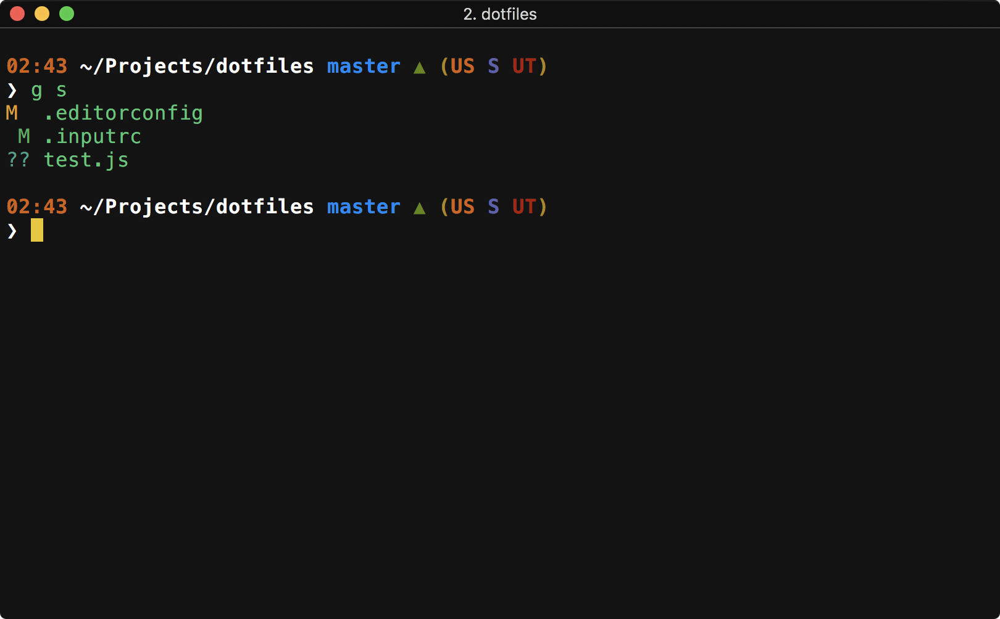

# dotfiles

> Some dotfiles and what not.


<p align="center">
  
</p>

## Working with stuff
* Install or update with `source bootstrap.sh`
* First time mac setup with `./.macos`
* Install common brew packages with `./brew.sh`

## Included function stuff

```bash
# Opens the github page for the current working dir
repo
```

```bash
# Create a new directory and enter it
mkdr
# EX: mkd foo
```

```bash
# Change working directory to the top-most Finder window location
cdf
```

```bash
# Determine size of a file or total size of a directory
fs
# EX: fs dotfiles
# 604K	dotfiles
```

```bash
# Create a data URL from a file
dataurl
# EX: dataurl logo.png
# data:image/png;base64,iVBORw0KGgoAAAANSUhEUgAAAtQAA...
```

```bash
# Start python simple HTTP server from a directory, optionally specifying the port
server
# EX: server
# Serving HTTP on 0.0.0.0 port 8000 ...
```

```bash
# Syntax-highlight JSON strings or files
json
# EX: echo '{"foo":42}' | json
```

```bash
# `tre` is a shorthand for `tree` with hidden files and color enabled
tre
```


## Links and stuff
* This is based heavily off the [Mathias dotfiles](https://github.com/mathiasbynens/dotfiles) repo.
